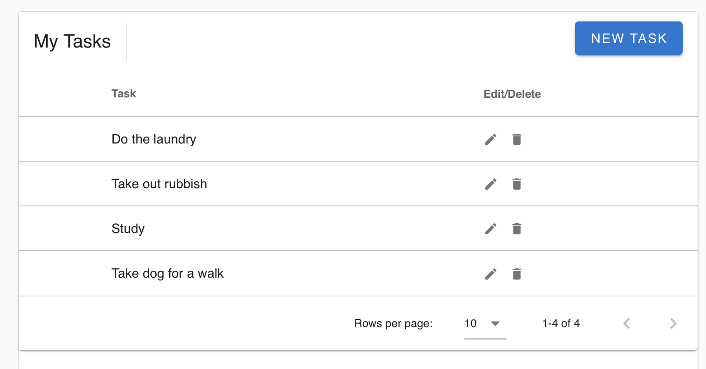

<h1>Light PHP Task List</h1>

</img>

## About Task list

A simple digital task list built in laravel and VueJS.

- Add, Edit, and delete tasks to organise your day
- Lightweight, works in any server or local computer environment  
- Easy and simple to use
- Free and Open to Use

##Install
To Install the task list, you must have PHP and composer installed
and be able to use command line with sudo or root access.

Use the following commands to run locally

```
$ git clone https://github.com/yegamble/tasklist.git

$ cd tasklist

$ cp .env.example .env 

```

<b>MySQL</b>

Type the following command.

```
$ docker-composer up -d

```

<b>SQLite</b>

If using SQLite due to environment issues, open the .env file open, look for the line labelled, DB_DATABASE 
and replace with the absolute directory of the file tasklist.sqlite (within the root folder of
this repository).

```
$ nano .env
```


Then generate the app key and start the service.
```
$ php artisan key:generate

$ php artisan migrate && php artisan config:clear && php artisan serve
```

After the commands execute, open your browser and navigate to https://localhost:8000
(port may vary if 8000 is busy, the command line terminal will display this number)

In some cases, the app
